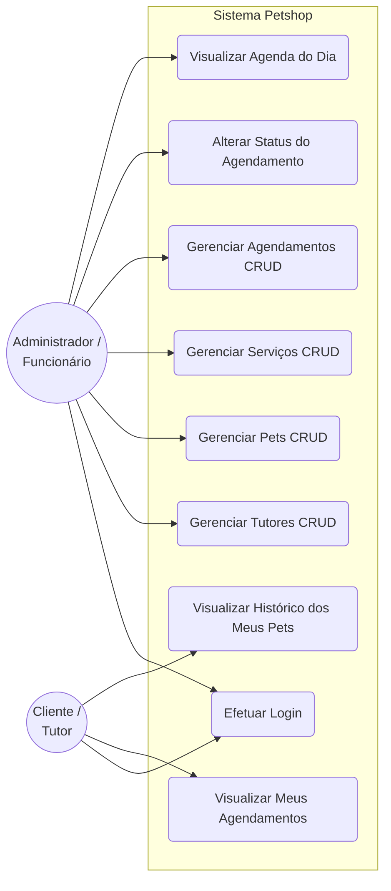

# Documentação do projeto de PHP sobre Pet Shop

## 1. *Introdução e Justificativa* (O contexto do problema)
    - O mercado pet no Brasil é um dos setores que mais cresce anualmente. Pequenos e médios petshops enfrentam dificuldades diárias no gerenciamento de suas operações devido ao uso de métodos arcaicos (como agendas de papel ou planilhas descentralizadas). Isso gera perda de informações, conflitos de horários nos banhos/tosas e falta de histórico dos animais.

    - O desenvolvimento deste sistema web baseado em PHP justifica-se pela necessidade de centralizar a gestão de clientes, pets e agendamentos em uma plataforma única, acessível e de baixo custo de manutenção, otimizando o tempo dos funcionários e melhorando a experiência do cliente final.

## 2. *Objetivos* (Geral e Específicos)
- Desenvolver um sistema web dinâmico para gerenciamento de petshops utilizando a linguagem PHP, banco de dados MySQL e tecnologias de front-end (HTML5, CSS3).

    * Objetivos Específicos:
        - Implementar um sistema de autenticação seguro para administradores e clientes.
        - Criar um módulo de cadastro e controle de tutores (clientes) e seus respectivos animais (pets).
        - Desenvolver uma agenda interativa para marcação de serviços (banho, tosa, consultas).
        - Garantir a persistência e integridade dos dados através de boas práticas com Banco de Dados Relacional.


## 3. *Definição de Escopo* (O que o sistema faz e o que ele não faz)
    * O que será desenvolvido:
        - Cadastro, edição e exclusão de Clientes e Pets (CRUD completo).
        - Agendamento de serviços com controle de status (Pendente, Concluído, Cancelado).
        - Painel administrativo para o funcionário visualizar a agenda do dia.
        - Autenticação de usuários (Login/Logout) com níveis de acesso.

    * O que não será desenvolvido:
        - Módulo de vendas de produtos (E-commerce).
        - Integração com gateways de pagamento em cartão ou Pix (o pagamento é feito no balcão).
        - Emissão de Nota Fiscal Eletrônica (NF-e). 

## 4. *Engenharia de Requisitos* (Requisitos Funcionais e Não-Funcionais)
* Os requisitos dividem-se em Funcionais (as ações que o sistema deve executar) e Não-Funcionais (as características de qualidade, segurança e tecnologia do sistema).

### 4.1 Requisitos Funcionais (RF)

> **Regra de Negócio Central:** O cliente possui apenas permissão de leitura (visualização) no sistema. Toda e qualquer inserção, alteração ou exclusão de dados é de responsabilidade exclusiva dos funcionários/administradores (Modelo Concierge).

| Código | Requisito Funcional | Descrição Detalhada | Nível de Acesso |
| :--- | :--- | :--- | :--- |
| **RF01** | Autenticação de Usuários | O sistema deve permitir o login diferenciando o Administrador (funcionário) do Cliente comum. | Ambos |
| **RF02** | Gerenciamento de Tutores | O administrador deve ser capaz de Cadastrar, Listar, Editar e Excluir clientes (tutores). | Admin |
| **RF03** | Gerenciamento de Pets | O administrador deve cadastrar e gerenciar os pets, obrigatoriamente vinculando cada animal a um tutor já cadastrado. | Admin |
| **RF04** | Cadastro de Serviços | O administrador deve gerenciar o catálogo de serviços oferecidos pelo petshop (ex: Banho, Tosa, Consulta) e seus respectivos valores. | Admin |
| **RF05** | Agendamento de Serviços | O administrador deve registrar os agendamentos, escolhendo o Pet, o Serviço, a Data e o Horário do atendimento. | Admin |
| **RF06** | Controle de Status | O administrador deve poder alterar o status de um agendamento para: *Pendente*, *Concluído* ou *Cancelado*. | Admin |
| **RF07** | Dashboard Operacional | O administrador deve visualizar, logo após o login, uma tela com os agendamentos programados para o dia atual. | Admin |
| **RF08** | Painel do Tutor | O cliente, ao logar, deve visualizar apenas o histórico de serviços e os próximos agendamentos dos seus próprios pets. | Cliente |

### 4.2 Requisitos Não-Funcionais (RNF)

* **RNF01 - Segurança da Informação:** O sistema não deve armazenar senhas em texto limpo. Todas as credenciais de acesso devem ser criptografadas utilizando a função nativa `password_hash()` do PHP antes de serem salvas no banco de dados.
* **RNF02 - Tecnologia e Persistência:** O backend do sistema deve ser desenvolvido inteiramente em PHP (versão 8.0 ou superior), utilizando a extensão PDO (PHP Data Objects) com o driver **pg_connect** para conexões seguras com o banco de dados **PostgreSQL**.
* **RNF03 - Interface e Responsividade:** O frontend deve ser construído em HTML5 e CSS3. A interface do *Painel do Tutor* deve ser responsiva, adaptando-se perfeitamente a telas de smartphones.
* **RNF04 - Integridade dos Dados:** O banco de dados deve utilizar restrições de chave estrangeira (`FOREIGN KEY`) com a cláusula `ON DELETE CASCADE` para garantir que, se um tutor for excluído, todos os seus pets e agendamentos vinculados sejam deletados automaticamente.


## 5. *Modelagem de Dados* (Dicionário de dados e Diagrama Entidade-Relacionamento)
* O dicionário de dados descreve a estrutura exata das tabelas do banco de dados MySQL, definindo os tipos de dados, restrições e o propósito de cada campo.



### 5.1 Tabela: `usuarios`
Armazena os dados de acesso tanto dos funcionários (administradores) quanto dos clientes (tutores).

| Campo | Tipo | Restrições | Descrição |
| :--- | :--- | :--- | :--- |
| `id` | SERIAL | PRIMARY KEY | Identificador único do usuário (Auto-incremento do Postgres). |
| `nome` | VARCHAR(100) | NOT NULL | Nome completo do usuário. |
| `email` | VARCHAR(100) | NOT NULL, UNIQUE | E-mail utilizado para login (não pode repetir). |
| `senha` | VARCHAR(255) | NOT NULL | Senha criptografada (via password_hash). |
| `telefone` | VARCHAR(20) | NULL | Telefone de contato. |
| `tipo` | VARCHAR(20) | NOT NULL | Define o nível de privilégio ('admin' ou 'cliente'). |
| `criado_em` | TIMESTAMP | DEFAULT CURRENT_TIMESTAMP | Data e hora de cadastro do registro. |

### 5.2 Tabela: `pets`
Armazena os animais cadastrados, vinculando-os obrigatoriamente a um tutor (usuário).

| Campo | Tipo | Restrições | Descrição |
| :--- | :--- | :--- | :--- |
| `id` | SERIAL | PRIMARY KEY | Identificador único do pet (Auto-incremento). |
| `cliente_id` | INT | FOREIGN KEY (`usuarios.id`) | ID do tutor proprietário do animal. |
| `nome` | VARCHAR(50) | NOT NULL | Nome do pet. |
| `especie` | VARCHAR(30) | NOT NULL | Espécie do animal (ex: Cão, Gato, Ave). |
| `raca` | VARCHAR(50) | NULL | Raça do animal. |
| `data_nascimento`| DATE | NULL | Data de nascimento aproximada do pet. |

### 5.3 Tabela: `servicos`
Catálogo de serviços oferecidos pelo petshop e seus respectivos preços.

| Campo | Tipo | Restrições | Descrição |
| :--- | :--- | :--- | :--- |
| `id` | SERIAL | PRIMARY KEY | Identificador único do serviço (Auto-incremento). |
| `nome_servico` | VARCHAR(50) | NOT NULL | Nome do serviço (ex: Banho e Tosa). |
| `preco` | NUMERIC(10,2) | NOT NULL | Valor cobrado pelo serviço (Tipo ideal para moedas no Postgres). |

### 5.4 Tabela: `agendamentos`
Registra os serviços marcados para os animais pelos funcionários.

| Campo | Tipo | Restrições | Descrição |
| :--- | :--- | :--- | :--- |
| `id` | SERIAL | PRIMARY KEY | Identificador único do agendamento (Auto-incremento). |
| `pet_id` | INT | FOREIGN KEY (`pets.id`) | ID do pet que receberá o atendimento. |
| `servico_id` | INT | FOREIGN KEY (`servicos.id`) | ID do serviço a ser prestado. |
| `data_hora` | TIMESTAMP | NOT NULL | Data e horário agendados. |
| `status` | VARCHAR(20) | DEFAULT 'pendente' | Situação do atendimento ('pendente', 'concluido', 'cancelado'). |


## 6. *Arquitetura do Software* (Padrão de projeto e estrutura de arquivos)

## 6. Arquitetura do Software e Estrutura de Arquivos

O projeto adota uma arquitetura modular baseada na separação de responsabilidades (conceito de Views e Actions). Essa abordagem garante que o código HTML (interface) não fique misturado com a lógica pesada de manipulação do banco de dados (PHP), facilitando a manutenção do sistema.

### 6.1 Padrão de Projeto (Design Pattern)
O sistema utiliza o padrão procedural estruturado com isolamento de ações através do método POST. 
* **Views (Telas):** Arquivos que contêm HTML, CSS e apenas estruturas de repetição simples em PHP (`foreach`, `if`) para exibir os dados na tela.
* **Actions (Ações):** Scripts PHP puros, sem HTML, responsáveis por receber os dados dos formulários, higienizá-los contra invasões (SQL Injection) e executar as operações no banco de dados.

### 6.2 Estrutura do Diretório do Projeto


```text
petshop/
│
├── config/
│   └── conexao.php          # Configuração do PDO e conexão com o MySQL
│
├── includes/
│   ├── header.php           # Barra de navegação e abertura do HTML (repetido)
│   └── footer.php           # Rodapé, scripts JavaScript e fechamento do HTML (repetido)
│
├── assets/                  # Arquivos estáticos do sistema
│   ├── css/
│   │   └── style.css        # Estilização customizada do painel e site
│   └── js/
│       └── main.js          # Validações e comportamentos em JavaScript
│
├── views/                   # Interfaces do usuário (Restritas por Sessão)
│   ├── login.php            # Tela de autenticação para Admin e Cliente
│   ├── dashboard.php        # Painel principal do Admin (Agenda do Dia)
│   ├── clientes.php         # Tela de CRUD (Cadastro/Listagem) de Clientes
│   ├── pets.php             # Tela de CRUD (Cadastro/Listagem) de Pets
│   ├── servicos.php         # Tela de CRUD (Cadastro/Listagem) de Serviços
│   ├── novo-agendamento.php # Tela de marcação de banho/tosa
│   └── painel-tutor.php     # Tela exclusiva do cliente (Visualização)
│
├── actions/                 # Scripts PHP de processamento de dados (Back-end)
│   ├── login-action.php     # Processa o login e cria a $_SESSION
│   ├── logout.php           # Destrói a sessão e desloga o usuário
│   ├── cliente-action.php   # Processa o Insert/Update/Delete de clientes
│   ├── pet-action.php       # Processa o Insert/Update/Delete de pets
│   ├── servico-action.php   # Processa o Insert/Update/Delete de serviços
│   └── agenda-action.php    # Processa novos agendamentos e alterações de status
│
└── index.php                # Página home institucional (Aberto ao público)


```


